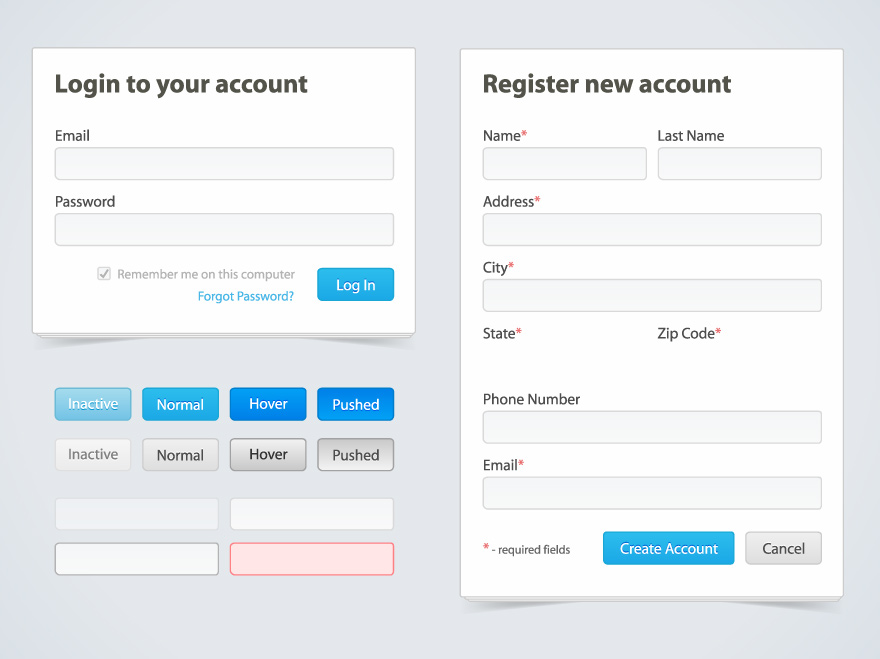

 **Principais exercícios realizados durante o módulo de Desenvolvimento para Internet**

 
 <!-- ex001 -->
 
 **Exercício Layout→** Treinando a construção da estrutura de um layout, utilizando como base o modelo [Basic 88](https://www.os-templates.com/free-basic-html5-templates/basic-88) do site [OS Templates](https://www.os-templates.com/).
 
  
 
 
  
  
 
>  
>> [clique aqui](https://aleretamero.github.io/faculdade/desenvolvimento-para-internet/ex001/index.html) para acessar o a página do projeto.
>>> [clique aqui](./ex001/) para acessar o diretório do projeto.

 
<!-- ex002 -->
 
 **Exercício Tabela→** Treinando a construção de uma tabela, utilizando como base o seguinte modelo:
 
  
 
  
 
  

>  
>> [clique aqui](https://aleretamero.github.io/faculdade/desenvolvimento-para-internet/ex002/index.html) para acessar o a página do projeto.
>>> [clique aqui](./ex002/) para acessar o diretório do projeto.

 
<!-- ex003 -->
 
**Exercício Formulário (em andamento) →** Treinando o uso de formulário para construção de uma tela de login, utilizando como base o seguinte modelo:
 
  
 
  
 
  

> 
>> [clique aqui](https://aleretamero.github.io/faculdade/desenvolvimento-para-internet/ex003/index.html) para acessar o a página do projeto.
>>> [clique aqui](./ex003/) para acessar o diretório do projeto.

 
