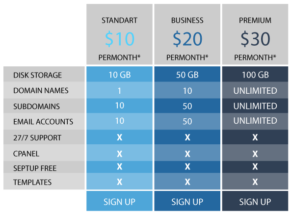

# principais-projetos-faculdade
 **Principais projetos desenvolvidos durante o curso de ADS (Uninove)**

 
 
 **treinando layout #1→** Treinando a construção da estrutura de um layout, utilizando como base o modelo [Basic 88](https://www.os-templates.com/free-basic-html5-templates/basic-88) do site [OS Templates](https://www.os-templates.com/).
 
  
 
 
  
  
 
>  
>> [clique aqui](https://aleretamero.github.io/principais-projetos-faculdade/treinando-layout-001/) para acessar o a página do projeto.

 

 **treinando tabela #1→** Treinando a construção de uma tabela, utilizando como base o seguinte modelo:
 
  
 
  
 
  

>  
>> [clique aqui](https://aleretamero.github.io/principais-projetos-faculdade/treinando-tabela-001/) para acessar o a página do projeto.

 
